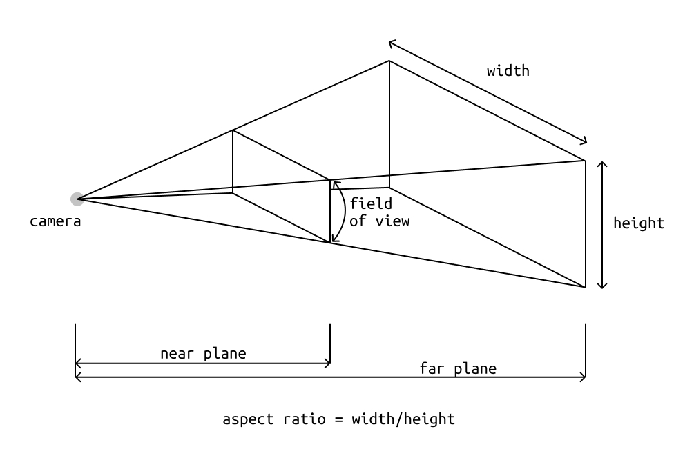

# 01 – Intro to Three.js – From nothing to importing an .obj model
*by Guillermo Montecinos, February 2021*

[Three.js](https://threejs.org/) is a powerful JavaScript library that allows rendering 3D graphics on the web browser, by using a [WebGL](https://www.khronos.org/webgl/) renderer. WebGL, on the other hand, is *simplily* a JavaScript API that allows the browser render 3D graphics in your computer's GPU. If you feel curious about the graphics rendering process check out the [first chapter](https://thebookofshaders.com/01/) of the Books of Shaders (actually if you are into shaders check out the entire book which is awesome).

In the following tutorial we will learn how to set up a basic three.js scene, display a basic element in it, animate it and illuminate it. Then, we'll learn how to control the camera with the mouse, to finally import an .obj model into the scene.

This tutorial is highly inspired on –not to say it's nearly a remix of– [Three.js Fundamentals](https://threejsfundamentals.org/) tutorial series by [https://gfxfundamentals.org/](https://gfxfundamentals.org/), and was written as part of my Residency at NYU ITP, 2020 – 2021.

## Index
* [The Three.js structure](#the-threejs-structure)
* [Hello world – Displaying a 3D Cube](#hello-world--displaying-a-3d-cube)
    * [Creating a camera](#creating-a-camera)
    * [Rendering a Basic Cube](#rendering-a-basic-cube)
    * [Animating the Cube](#animating-the-cube)
* [Making the canvas responsive](#making-the-canvas-responsive)
* [Adding basic lights](#adding-basic-lights)
* [Implementing Orbit Control](#implementing-orbit-control)
* [Importing an .OBJ file](#importing-an-obj-file)
* [Appendix: Running a local server](#appendix-running-a-local-server)

## The Three.js structure
Three.js' structure is very similar to any 3D engine like Unity, Unreal or Spark AR. There is a `scene` that parents all the elements in it: `lights`, `meshes`, `materials`, `geometries`, etc. The scene implies a hierarchical structure of properties heritage, where childs inherit their parent's physical properties like position, rotation and scale (the three of them are usually known in the computer graphics world as the transform).

In order to be able to see a `scene` and all the elements on it, we need a `camera` that captures and represents them as a 2D image, and a `renderer` that takes both the physical info from the scene and the graphic info from the camera and renders it on an HTML canvas (the same canvas on top of which p5.js works).

<p align="center">
  
</p>

Finally, physical objects are represented as meshes. In three.js, a `mesh` is composed by a `geometry` and a `material`. The first one describes the spaciality of the shape, which means the `vertices` that compone each face of the shape, the `normals` which are the normal vector to each of the faces, and the `uv` coordinates, which represent how a material is mapped to the geometry. On the other hand, the `material` represents the visual `shell` of the geometry.

## Hello world – Displaying a 3D Cube
Let's start our 3D web journey by displaying a basic and boring cube. To do that let's create an HTML canvas with a given id, which can be pointed by the renderer element from three.js. You can find the code [here](./code).

```html
<canvas id='c'></canvas>
```
Then, let's create a JavaScript sketch and import it into the HTML file. Note that the HTML `<script>` has its `type` parameter set as `module` which means the way of importing libraries to our sketch is different, what will be seen more clearly on the next step.

```html
<canvas id='c'></canvas>
<script src='intro-to-three.js' type="module"></script>
```

Go to the JavaScript file, and type the following to import Three.js as a module into your program.
```js
import * as THREE from 'https://unpkg.com/three@0.121.1/build/three.module.js'
```
The above statement means: *Import everything contained in the module loaded from the given url under the name* `THREE`. Then, let's declare a variable to instantiate the canvas as a DOM object by calling:

```js
const canvas = document.getElementById('c')
```
Note that we declared `canvas` as a `const`. We will do this very often during this tutorial because since 3D processing is computationally heavy, it's a good practice to write our code as effcient as possible. Then, let's create a `renderer` object that points to the `canvas`, which means the `renderer` will pass the camera and scene information to the laptop's GPU in order to get a 2D representation of the space based on the camera's perspective, and then it will display it on the canvas.

```js
const renderer = new THREE.WebGLRenderer({canvas})
```
### Creating a camera
Since we already declared our `renderer`, we need two more elements to have the 3D world rendered on the canvas: a `scene` and a `camera`, let's start with cameras. In 3D graphics there are two main types of cameras: **perspective** and **orthographic** cameras. Perspective cameras simulate the behave of the human eye by replicating the perspective of a set of elements in the space, this means farther elements look smaller than closer elements. On the other hand, orthographic cameras use orthographic projection, also known as parallel projeciton. This means elements keep their size on the camera, even if they are at different distances from it.

In our case, we will use three.js' [`PerspectiveCamera`](https://threejs.org/docs/index.html#api/en/cameras/PerspectiveCamera), which takes four elements as arguments on its constructor: `fov` which represent the vertical [field of view](https://en.wikipedia.org/wiki/Field_of_view_in_video_games) (measured in degrees), `aspect` which respresents the aspect ratio of the camera, `near` which represents the distance between the camera and the near plane, and `far` which represents the distance between the camera and the farther plane. These 4 elements conform what is known as the camera frustrum or [viewing frustrum](https://en.wikipedia.org/wiki/Viewing_frustum).

<p align="center">
  
</p>

For our example camera let's declare the following parameters:

```js
const fov = 60
const aspect = 2
const near = 0.01
const far = 10
const camera = new THREE.PerspectiveCamera(fov, aspect, near, far)
camera.position.set(0, 0, 2)
```

This means, the field of view is 60º, the aspect ratio is `2:1`, the nearest plane is 0.01 units from the camera, and the farthest plane is 10 units away from the camera. After creating the camera element, we need to create a scene which is where physically our elements will live. Let's also set the camera position to `(0, 0, 2)`, which means the camera is just `2` units above the origin in the `z-axis`.

```js
const scene = new THREE.Scene()
scene.add(camera)
```

### Rendering a Basic Cube
As we mentioned earlier, in three.js physical objects are represented by a `mesh`, which is composed by a `geometry` and a `material`. Geometries are –in simple– collections of data organized in arrays that represent different parameters of a 3D object: the `position` of the vertices that define the mesh's structure, the `normal` vectors to the faces defined by those vertices, and the `uv` coordinates that define how the material is wrapped around the mesh.

Let's create a basic box geometry using [`THREE.BoxGeometry(width, height, depth)`](https://threejs.org/docs/index.html#api/en/geometries/BoxGeometry), that simplily instantiates a cube with the given width, height and depth. Then, let's create a basic material using [`THREE.MeshBasicMaterial({color})`](https://threejs.org/docs/index.html#api/en/materials/MeshBasicMaterial), which will instantiate a simple shaded material that doesn't get affected by ligths. This means, we don't need to create a light in order to see the material. Subsequently let's create a mesh object [`THREE.Mesh(geometry, material)`](https://threejs.org/docs/index.html#api/en/objects/Mesh) that takes both the `geometry` and `material` as arguments, and add it to the scene by calling `scene.add(mesh)`.

```js
const cubeGeometry = new THREE.BoxGeometry(1, 1, 1)
const cubeMaterial = new THREE.MeshBasicMaterial({ color: 0x4d4fc6})
const cubeMesh = new THREE.Mesh(cubeGeometry, cubeMaterial)
scene.add(cubeMesh)
```

Finally, let's call the `render` method of the renderer object which -as we said before- takes the `scene` spatial data and renders a 2D projection of the `camera`.

```js
renderer.render(scene, camera)
```

<p align="center">
  
</p>

### Animating the Cube
Now that we have a plain and boring cube being rendered on the canvas, let's animate it. To do that we have to include the temporal dimension somewhere in our program, so we can perform changes to any of the cube's atrributes based on time.

We can do that with the DOM's function [`requestAnimationFrame`](https://developer.mozilla.org/en-US/docs/Web/API/window/requestAnimationFrame), a method of the `window` interface that tells the browser to update its content before the next repaint. It takes a callback function which performs the animation update, and passes it the current time measured in milliseconds since the moment the program started. The animation relies on the callback to recursively call `requestAnimationFrame` in order to keep the window content updated, and has to be triggered by calling `requestAnimationFrame` once.

In order to animate, first of all let's create the callback function `renderFrame(time)` that takes the current time as an argument. Then, let's scale down that time (remember it's measuerd in milliseconds) and use it perform a rotation to the cube. We can apply a rotation to the object's transform by calling `cubeMesh.rotation.set(angleX, angleY, angleZ)`. After that, let's render the `scene` and `camera` as we explained before and recursively call `requestAnimationFrame(renderFrame)` passing the callback as an argument. Finally, let's call `requestAnimationFrame(renderFrame)` once to trigger the animation sequence.

```js
function renderFrame(time){
    time *= .0005
    cubeMesh.rotation.set(time, time, 0)
    renderer.render(scene, camera)
    requestAnimationFrame(renderFrame)
}
requestAnimationFrame(renderFrame)
```

<p align="center">
  
</p>

## Making the canvas responsive
Making the canvas responsive means two things: that the canvas fits the size of the screen and its resolution matches the screen's. Since the default HTML canvas' size is 300 x 150 pixels, we have to make the canvas cover the entire screen using basic CSS, by firstly matching the document body's height with the page's height and getting rid of all margins. Sencondly, we have to set the canvas' width and height as `100%` so it fits the body's width and height.

```css
<style>
html, body {
   margin: 0;
   height: 100%;
}
#c {
   width: 100%;
   height: 100%;
   display: block;
}
</style>
```
Two more problems have to be solved: first, we have a pixelated image of the scene because the `renderer` is still formatted based on the original `canvas` size, and secondly, the `camera`'s aspect ratio is not responsive to the `renderer`'s aspect ratio, so any change on the window will deform the image.

Let's start by fixing the first problem. Inside the `renderFrame` method, let's declare a representation of the canvas that we get through the `renderer` element. Remember that the actual canvas is the environment where the renderer performs rendering, and it is the element it is attached to. We can access the canvas by retrieving the DOM element associated with the `renderer`, and can use its size to estimate what should be the current camera's aspect ratio. After doing this, we have to update the camera's projection matrix.

```js
const cnv = renderer.domElement;
camera.aspect = cnv.clientWidth / cnv.clientHeight;
camera.updateProjectionMatrix();
```

Now we can fix the resolution problem by declaring a function called `resizeRenderToDisplaySize()`, which evaluates if the `renderer`'s size is different to the canvas's size. To do that, we must retrieve the canvas element the same way we did in the case above and compare its `width` with its [`clientWidth`](https://developer.mozilla.org/en-US/docs/Web/API/Element/clientWidth), and its `height` with its `clientHeight`. We must do this, because `width` represents the canvas's width, while `clientWidth` represents the width of the canvas's HTML parent (which in this case is the page's `body`). Anytime either width or height are different we must resize the `renderer` to the window's size.

```js
function resizeRendererToDisplaySize(renderer){
    const cnv = renderer.domElement
    // get the browser window's size
    const width = cnv.clientWidth
    const height = cnv.clientHeight

    const needsResize = width != cnv.width || height != cnv.height

    if (needsResize) {
        renderer.setSize(width, height)
    }
}
```
## Adding basic lights
As you may have noticed, the edges of the box can't be seen when the element is rotating in front of the camera, which is because the `MeshBasicMaterial` does not get affected by lights. To solve this we have to do two things: changing the material for one that is affected by lights, and adding a light to the scene. Changing the material is pretty simple, and in this example we will use [MeshPhongMaterial](https://threejs.org/docs/index.html#api/en/materials/MeshPhongMaterial) to get a shinning surface, instead of `MeshBasicMaterial`.

```js
const cubeMaterial = new THREE.MeshPhongMaterial({ color: 0x4d4fc6})
```

Then we have to add a new [`THREE.DirectionalLight`](https://threejs.org/docs/index.html#api/en/lights/DirectionalLight), that takes a color and the light's intensity value as arguments, which we can set a bit away from the origin. Please note that the light's default target is the origin, so we don't have to worry about this parameter because it coincides with the box's position.

```js
const lightColor = 0xFFFFFF
const lightIntensity = 1
const light = new THREE.DirectionalLight(lightColor, lightIntensity)
light.position.set(-1, 2, 4)
scene.add(light)
```

## Implementing Orbit Control
Let's now add an orbit controller to the scene which will allow us to move the camera around a target point. First of all, let's import the Orbit Control package.

```js
import {OrbitControls} from 'https://threejsfundamentals.org/threejs/resources/threejs/r119/examples/jsm/controls/OrbitControls.js'
```
Then, let's declare an instance of the orbit control by calling the constructor function `OrbitControl` that takes both the camera and canvas as arguments. It is recommended to comment the line that updates the box's rotation, in order to have only one element moving in the scene (in this case the camera).

```js
const controls = new OrbitControls(camera, canvas);
```

<p align="center">
  
</p>

## Importing an .OBJ file

Before importing the 3D model to the scene let's add an [`HemisphereLight`](https://threejs.org/docs/index.html#api/en/lights/HemisphereLight) that simulates the sky light. It is recommended to include this type of lights when importing 3D models, because they take the sky and ground colors and fade from one to the other, projecting them on the model's material.

```js
const skyColor = 0xB1E1FF
const groundColor = 0xB97A20
const hemisphereLightIntensity = 1.5
const hemisphereLight = new THREE.HemisphereLight(skyColor, groundColor, hemisphereLightIntensity)
scene.add(hemisphereLight)
```

Then, let's import a 3D model formatted as an `.obj` file. To do that, we need to import the `OBJLoader2` module which will do everything for us. 
```js
import {OBJLoader2} from 'https://threejsfundamentals.org/threejs/resources/threejs/r122/examples/jsm/loaders/OBJLoader2.js';
```
To import the model, we need to instantiate the loader and call the method `objLoader.load()` that takes the model's path as an argument and a callback function inside which we can add the model to the scene.

```js
const modelPath = './roadbike.1.0.obj'
const objLoader = new OBJLoader2()
objLoader.load(modelPath, (model) => {
    scene.add(model)
})
```

<p align="center">
  
</p>

As you may have noticed we have successfully loadded a 3D model to our scene, but the model has no materials and the camera is not properly placed in the world in order to let us appreciate our bike. Let's reset the camera's `far` parameter and `position` in order to properly see the object.

```js
const far = 50
camera.position.set(12, 0, 0)
```

<p align="center">
  
</p>

To import the model's materials let's first import the modules `MTLLoader` and `MtlObjBridge`, which will load the object's material and parse it to an understandable format by the `objLoader` object.

```js
import {MTLLoader} from 'https://threejsfundamentals.org/threejs/resources/threejs/r119/examples/jsm/loaders/MTLLoader.js'
import {MtlObjBridge} from 'https://threejsfundamentals.org/threejs/resources/threejs/r119/examples/jsm/loaders/obj2/bridge/MtlObjBridge.js'
```

We use the `mtlLoader` to load the material file calling `mtlLoader.load()`, that similarly to the `objLoader` takes the material's path and a callback function as arguments.

```js
const mtlLoader = new MTLLoader()
mtlLoader.load(materialPath, (preMaterial) => {
    
})
```
Inside the callback we must parse the raw material called `preMaterial` with the function `MtlObjBridge.addMaterialsFromMtlLoader(preMaterial)`. Then, after instantiating the `objLoader2` object we can pass it the parsed material and properly load the `.obj` file to the scene.

```js
const materialPath = './assets/plazadignidad-cau-1219/plazadignidad-cau-1219.mtl'
const mtlLoader = new MTLLoader()
mtlLoader.load(materialPath, (preMaterial) => {
    const material = MtlObjBridge.addMaterialsFromMtlLoader(preMaterial)
    // Load OBJ model
    const modelPath = './assets/plazadignidad-cau-1219/plazadignidad-cau-1219.obj'
    const objLoader = new OBJLoader2()
    objLoader.addMaterials(material)
    objLoader.load(modelPath, (model) => {
        scene.add(model)
    })
})
```

<p align="center">
  
</p>

## Appendix: Running a local server
Either in Windows and Mac you can run an HTTP local server using Python. If you are using windows check if Python is installed writing the following command in your shell:

```
python -V
```

Then your terminal, go to the folder where your root file is located, in general this file is called `index.html`, and run the following commands:
* Python 2
```
$ python -m SimpleHTTPServer port
```
* Python 3
```
$ python -m http.server port
```

Source: [How do you set up a local testing server? – MDN Web Docs](https://developer.mozilla.org/en-US/docs/Learn/Common_questions/set_up_a_local_testing_server)