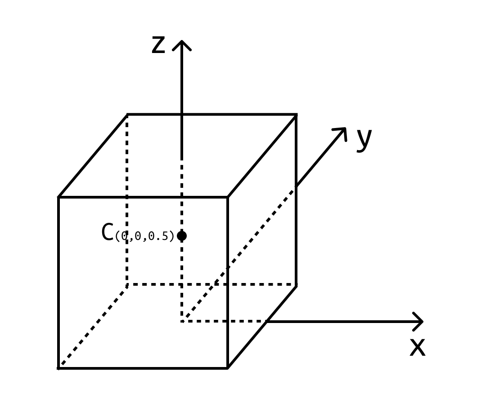

# 02 – Intro to Three.js – Matrices and interaction
*by Guillermo Montecinos, March 2021*

> *"In fact, it is no longer really the real, because no imaginary envelops it anymore. It is a hyperreal, produced from a radiating synthesis of combinatory models in a hyperspace without atmosphere."* – Jean Baudrillard

This tutorial is the second of the *Intro to three.js series*. In this one we will create a simple 3D game that consists of a cube moving over a checkers plane. Through the design of this, we will learn how to natively listen to user interactions in the browser, and dive in the world of 3D matrices to transform the cube's position in the scene. If this is your first time with three.js or computer graphics in general, check the previous tutorial [01 – Intro to Three.js – From nothing to importing an .obj model](https://github.com/guillemontecinos/itp-residency-2020-2021/blob/master/three-js/tutorials/01-intro-to-threejs/intro-to-threejs.md), to have a sense of how the 3D world is organized and how to setup a basic scene.

<p align="center">
  
</p>

## Scenario Setup
Let's start by setting up the scenario where our lonely cube will exist and move around.

### Basic Setup – Canvas, Renderer, Scene and Lighting
Let's invoke the basic three.js elements to setup a boring black scene (please check [tutorial 01](https://github.com/guillemontecinos/itp-residency-2020-2021/blob/master/three-js/tutorials/01-intro-to-threejs/intro-to-threejs.md) for further information). Start by importing three.js, remember it is recommended to import it as a module since the script we are working on is a module too. Then, let's declare a variable to store an instance of the HTML canvas, a [`THREE.WebGLRenderer`](https://threejs.org/docs/index.html#api/en/renderers/WebGLRenderer) pointing to that canvas, and a [`THREE.Scene`](https://threejs.org/docs/index.html#api/en/scenes/Scene) that represents the 3D world. Subsequently, let's create a [THREE.HemisphereLight](https://threejs.org/docs/index.html#api/en/lights/HemisphereLight) light which represents the skylight and takes two colors –one for the sky and other for the ground– that blend in the scene.

```js
import * as THREE from 'https://unpkg.com/three@0.121.1/build/three.module.js'

// Three.js setup
const canvas = document.getElementById('c')
const renderer = new THREE.WebGLRenderer({canvas})
const scene = new THREE.Scene()

// Hemisphere Light
const skyColor = 0xffffff
const groundColor = 0xddc199
const hemisphereLightIntensity = 1.5
const hemisphereLight = new THREE.HemisphereLight(skyColor, groundColor, hemisphereLightIntensity)
scene.add(hemisphereLight)
```
### Plane Setup – Geometry, Texture and Guard
Since every space needs a point of reference, let's create a plane to define what is the game's area and the floor of our 3D world. To do that, let's create the [`THREE.PlaneGeometry`](https://threejs.org/docs/index.html#api/en/geometries/PlaneGeometry) and the material that gives visual appeal to the plane, by calling [`THREE.MeshPhongMaterial`](https://threejs.org/docs/index.html#api/en/materials/MeshPhongMaterial). Then, let's create the plane's mesh by calling [`THREE.Mesh`](https://threejs.org/docs/index.html#api/en/objects/Mesh), a mesh constructor that takes the `planeGeometry` and `planeMaterial` as arguments, and finally add the `planeMesh` to the `scene`.

```js
// Plane
const planeSize = 20
// Plane geometry decalaration
const planeGeometry = new THREE.PlaneGeometry(planeSize, planeSize)
// Plane Material decalaration
const planeMaterial =  new THREE.MeshPhongMaterial({
    color: 0xefdcac
})
// Plane Mesh creation
const planeMesh = new THREE.Mesh(planeGeometry, planeMaterial)
scene.add(planeMesh)
```

You probably can't see the plane, and instead of that you only see darkness on your browser. This is because we haven't set a camera yet to render the elements of the scene. Let's then add a simple `PerspectiveCamera` standing `-18` units on the `y-axis` from the origin, and `5` units up on the `z-axis`.

```js
const fov = 70
const aspect = 2
const near = 0.01
const far = 20
const camera = new THREE.PerspectiveCamera(fov, aspect, near, far)
scene.add(camera)
camera.position.set(0, -18, 5)
camera.lookAt(0, 0, 0)
```

<p align="center">
  
</p>

Something important to keep in mind is the coordinate system (which is really important, actually). Every 3D engine has their own coordinate convention and –as a friend of mine says– *humans have spent too many hours trying to figure out what's the system of each engine*. And as you may remember from school, the most important thing of a coordinate system is that you must reference everything to one main system, and you must be strict and coherent with it. In our case, we will assume that the plane lays on the `x-y` plane of the system, and the `z-axis` points up in the world. This is commonly called *right–hand positive `z`*, which means if you apply the [*right-hand* rule](https://en.wikipedia.org/wiki/Right-hand_rule) in a rotation from the `x-axis` to the `y-axis`, your thumb will point in the direction of the `z-axis`.

<p align="center">
  
</p>

Let's finally add a texture to the plane in order to make it look as a checkers's board, and set a visual reference that makes the cube moving around the space understandable. This section has been taken from the [Three.js Loading a .OBJ File](https://threejsfundamentals.org/threejs/lessons/threejs-load-obj.html) tutorial from [threejsfundamentals.org](https://threejsfundamentals.org) and so its assets. Let's start by instantiating the [`THREE.TextureLoader`](https://threejs.org/docs/index.html#api/en/loaders/TextureLoader) class and using it to load a basic checkers texture. Then, let's setup the texture's UV mapping in order to repeat the texture all over the mesh, by setting `texture.wrapS` and `texture.wrapT` to `THREE.RepeatWrapping`.

```js
// Texture instance
const loader = new THREE.TextureLoader();
// Texture load
const texture = loader.load('https://threejsfundamentals.org/threejs/resources/images/checker.png');
// Texture UV mapping
texture.wrapS = THREE.RepeatWrapping;
texture.wrapT = THREE.RepeatWrapping;
```

Note that the texture we just loaded is `2 x 2`, which means it conly has 4 pixels of information. Since we need to map this to a bigger surface, we will have to use the property `magFilter` of the [THREE.Texture](https://threejs.org/docs/index.html#api/en/textures/Texture) class and set it to [`THREE.NearestFilter`](https://threejs.org/docs/index.html#api/en/constants/Textures) which *returns the value of the texture element that is nearest (in Manhattan distance) to the specified texture coordinates*.

```js
// Texture magnification
texture.magFilter = THREE.NearestFilter;
// Texture setup
const repeats = planeSize / 2;
texture.repeat.set(repeats, repeats);
```
<p align="center">
  
</p>

## Player Setup – Cube and Camera
### Creating a cube-shaped player
In this tutorial our player will be a cube... not creative at all, but good to start. Let's create the cube's geometry by calling `THREE.BoxGeometry` and let's use a `THREE.MeshPhongMaterial` to give it a look that gets affected by lighting. 

```js
// Cube setup
const cubeGeometry = new THREE.BoxGeometry(1, 1, 1)
const cubeMaterial =  new THREE.MeshPhongMaterial({color: 0x873e2d})
const cubeMesh = new THREE.Mesh(cubeGeometry, cubeMaterial)
```

Note that the cube's `(0, 0, 0)` coordinate coincides with the actual center of the shape, which means that if we set `cubeMesh.position.set(0, 0, 0)` the cube will be cut by the ground plane right in the middle. To solve that, we must set the position's `z-coordinate` to `z = 0.5`, meaning that the cube is translate the half of its height up.

```js
cubeMesh.position.set(0, 0, .5)
```

<p align="center">
  
</p>

In 3D graphics it is very common to represent the position of a body by a matrix called the [Transformation Matrix](https://en.wikipedia.org/wiki/Transformation_matrix), which is nothing else than a set of numbers arranged in a `4 x 4` grid to describe the current Translation, Rotation and Scale of a 3D body. Please check out the [Appendix – 3D Matrices](#appendix--3d-matrices) to ge a first shot in surreal world of matrices.

Seomething important we need to keep in mind is that every time we create a new `THREE.Mesh`, its `Mesh.matrix` object –which stores the 3D matrix elements– is automatically updated by Three.js on every rendering. Since in this case we want to manually modify the matrix, it is needed to disable this property to avoid data overridings, which can be done by setting `cubeMesh.matrixAutoUpdate = false`. This also implies that the matrix never gets updated automatically, hence the position we set in the previous stage won't be automatically applied. We can force this by calling `cubeMesh.updateMatrix()`, which updates the matrix once. Finally, let's add `cubeMesh` to the scene in order to rendered.

```js
// Set matrixAutoUpdate to false in order to avoid the renderer recalculating the matrix on every frame, in this way we can manipulate the matrix by hand. Despite, call updateMatrix() for once in order to set position.
cubeMesh.matrixAutoUpdate = false
cubeMesh.updateMatrix()
scene.add(cubeMesh)
```

### Attaching a camera to the player
Now in order to make this look like a game, we have to create a camera and attach it to the cube. This way we can make the scene be rendered from above the cube as in the image below.

<p align="center">
  
</p>

To do that let's recycle the camera we created earlier and instead of adding it to the scene, let's add it to `cubeMesh`.

```js
// Attach the camera as a child of the cube. This way the camera's coordinate system (or matrix) is referenced to the cube's
cubeMesh.add(camera)
```

By doing that we are telling three.js that the `(0, 0, 0)` of the camera's coordinate syste is not the scene's center bu the cube's center, which lays on the coordinate `(0, 0, 0.5)` of the scene's system. This is known in math as relative coordinate systems, which means a secondary system becomes child of a primary system, inheriting its transformation properties. This implies that if a rotation or a translation are applied to the cube, the camera will stay in the same relative position respect to the cube.

Now, we have to make two more changes to the camera position in order to look as the image above: first, we need to set it's position relative to the cube's center `-1.1` units behind the cube's center in the `y-axis`, and `1` unit above the cube's center in the `z-axis`. Then, we must set the point where the camera is looking to, in this case `(0, 1, .5)`.

```js
camera.position.set(0, -1.1, 1)
camera.lookAt(0, 1, .5)
```

<p align="center">
  
</p>

## 3D transforms and interaction
In this section we will implement the user interactions that enable the player move in the world and will use them to modify the player's position in the space.

### Setting User Interaction
In this section we will declare the variables and functions needed to read the user interactions that enable the player to move in the space. There are two main interactions we are going to implement: translation front and back, and vertical rotation. The first one means the player can move forward and backward by pressing two keys in the keyboard, while the second means the player can rotate to its left or right controlled by the mouse.

#### Translation interaction
Before starting to implement any interaction, it is important to say that –as it happens in other bwoser-based graphic frameworks such as p5.js– the 3D transformation we want to apply to the object is a time based function, which means it happes in the `requestAnimationFrame()` function (Please refer to the [01 – Intro to Three.js – From nothing to importing an .obj model](https://github.com/guillemontecinos/itp-residency-2020-2021/blob/master/three-js/tutorials/01-intro-to-threejs/intro-to-threejs.md)).

<p align="center">
    
</p>

Taking that into account, we need to implement a variable that keeps track of the interaction in real time, this means: we need to know when the forward key is being pressed and when it's not, for which we will declare the booleans `moveFront` and `moveBack`, both initialized as `false`. To be consistent with the gaming tradition, we'll use the keyword `w` for moving forward and `s` for moving backward.

```js
// User interaction
let moveFront = false, moveBack = false
```

Then, let's attach two event listeners to the `window` DOM element (please refer to this [Introduction to the DOM](https://developer.mozilla.org/en-US/docs/Web/API/Document_Object_Model/Introduction) document –by [MDN](https://developer.mozilla.org/en-US/)– to get a better sense of what the Document Object Model is), one for the event `keydown` and the other for `keyup`. Inside each of them we need to check whether the `key` value of the event is `w` or `W` for moving front, and `s` or `s` for moving back. Then, when the `keydown` happens we have to set each variable to `true`, because the translation forward is starting, and the opposite when the `keyup` event happens.

```js
// Use keyboard pressed event to detect if W & S keys are pressed: W to move front and S to move back. Key down sets the moment when the interaction starts and keyup the moment when the interaction stops.
window.addEventListener('keydown', (e) => {
    if(e.key === 'w' || e.key === 'W'){
        moveFront = true
    }
    else if(e.key === 's' || e.key === 'S'){
        moveBack = true
    }
})
window.addEventListener('keyup', (e) => {
    if(e.key === 'w' || e.key === 'W'){
        moveFront = false
    }
    else if(e.key === 's' || e.key === 'S'){
        moveBack = false
    }
})
```

#### Rotation interaction
The second interaction we want to implement is a rotation in the direction of the cube based on the mouse's position, that enables the user face the cube towards they want to move. This is a rotation on around the `z-axis` that calculates the angular speed based on the relative horizontal position of the mouse relative to the center of the screen.

<p align="center">
    
</p>

First of all, let's declare a variable called `boxZRotSpeed` –initialized as `0`– which will store the current [angular velocity](https://en.wikipedia.org/wiki/Angular_velocity) of the box. Then, let's attach an event listener to the `canvas` to track the `mousemove` event (this means, every time the mouse moves over the canvas an event will be triggered), inside which we have to check if whether mouse is on the central area of the screen or not. To do that, let's set a band of `+/- 75px` around `renderer.domElement.clientWidth / 2`, which the center of the `canvas`. If the mouse is inside that band we set `boxZRotSpeed = 0`, if not we map that distance to the angular speed (note that the angular velocity we are mapping to is very small, since the box is rotated by that amount on every new frame).

```js
// Declare a mousemove event to detect the current mouse's position and calculate a rotation speed based on that. That angular speed will be applied to rotate the cube on each frame update.
let boxZRotSpeed = 0
canvas.addEventListener('mousemove', (e) => {
    if(e.offsetX > renderer.domElement.clientWidth / 2 + 75 || e.offsetX < renderer.domElement.clientWidth / 2 - 75) {
        boxZRotSpeed = THREE.MathUtils.mapLinear(e.offsetX, 0, renderer.domElement.clientWidth, Math.PI / 300, -Math.PI / 300)
    }
    else { 
        boxZRotSpeed = 0
    }
})
```

### Transforming the Player's matrix
At this stage you should have a box in the middle of a checkers-like plane, which you are looking from above and is not moving anywhere even we have setup some event listeners. In order to convert this inputs into movement, we have to calculate and apply a spatial transformation to the object. To do that, let's start by declaring a function called `updateCubeTransform()` that will be called from the frame update function (refer to the [01 – Intro to Three.js – From nothing to importing an .obj model](https://github.com/guillemontecinos/itp-residency-2020-2021/blob/master/three-js/tutorials/01-intro-to-threejs/intro-to-threejs.md)). In order to make our calculations as much efficient as possible, on every call of the function let's check if any of the interactions is happening.

```js
function updateCubeTransform() {
    // For efficiency purposes let's make all calculations and matrix update only when an interaction is detected
    if(moveFront || moveBack || boxZRotSpeed != 0) {

    }
}
```
#### Starting with an `Identity` matrix
Each time we need to update the cube's transform we must create a new `Transformation` matrix. This matrix will be used to contain the two transformations –*rotation* and *translation*– before applying them to the body itself. This means, we create an `Identity` matrix (analogue to what the number `1` represents in `n = 1` dimensions but in `n = 4` dimensions) and apply the rotation and translation transforms to that matrix before applying them to the cube's matrix.

```js
function updateCubeTransform() {
    // For efficiency purposes let's make all calculations and matrix update only when an interaction is detected
    if(moveFront || moveBack || boxZRotSpeed != 0) {
        // Declare an identity 4x4 matrix that will store rotation and translation transforms, and subsequently will be applied to the mesh's matrix
        const transformMatrix = new THREE.Matrix4()
    }
}
```
<p align="center">
    
</p>

#### The `Rotation` matrix
In the world of matrices, [the order of the factors **does** alter the product](https://en.wikipedia.org/wiki/Matrix_multiplication). Unlike scalar multiplications, if we have for example two `2 x 2` matrices `A` and `B`, the product `A * B != B * A`. Because of this, it is extremely important to be aware of the proper order in which the transformations should be applied to the object. Since we want the player to move the cube in the direction it is currently facing to, it is required to firstly apply the **rotation** and then apply the **translation** to the matrix. This is because when rotating the object, we are rotating it's coordinate system with it, hence when translating it after the rotation, the direction of the translation will be based in the new coordinate system.

Let's create then a [`Rotation`](https://en.wikipedia.org/wiki/Rotation_matrix) matrix by setting a new `4 x 4` `Identity` matrix from a rotation around the `z-axis`. There are two ways of doing this: one is by calling the function [`THREE.matrix4().makeRotationAxis(axis, theta)`](https://threejs.org/docs/index.html#api/en/math/Matrix4.makeRotationAxis), which takes a [`THREE.Vector3`](https://threejs.org/docs/index.html#api/en/math/Vector3) as the axis, and the angle in radians. The second way uses [*Quaternions*](https://en.wikipedia.org/wiki/Quaternion) and makes the rotation matrix based on a quaternion, which is made from a rotation around an axis. This may sound like overdoing right now, but is the most precise way of making rotations in 3D, since quaternions represent rotations more accurately than Euler angles (please refer to the video [How quaternions produce 3D rotation](https://www.youtube.com/watch?v=jTgdKoQv738) by Animated Math, [Quaternions and 3d rotation, explained interactively](https://www.youtube.com/watch?v=zjMuIxRvygQ) by 3Blue1Brown, and [Euler (gimbal lock) Explained](https://www.youtube.com/watch?v=zc8b2Jo7mno) by GuerrillaCG for further information).

Let's use the second method. First of all, let's make a quaternion from a rotation around the `z-axis` by calling [`new THREE.Quaternion().setFromAxisAngle(axis, angle)`](https://threejs.org/docs/index.html#api/en/math/Quaternion.setFromAxisAngle), where `axis = new THREE.Vector3(0, 0, 1)` and `angle = boxZRotSpeed`. Then, let's make the `Rotation` matrix from the quaterinion by calling [`new THREE.Matrix4().makeRotationFromQuaternion(rotationQuat)`](https://threejs.org/docs/index.html#api/en/math/Matrix4.makeRotationFromQuaternion).

```js
// Rotation
// Declare a quaternion from an axis rotation around z (because in our system z is pointing up)
const rotationQuat = new THREE.Quaternion().setFromAxisAngle(new THREE.Vector3(0, 0, 1), boxZRotSpeed)
// Declare a 4x4 matrix from the quaternion that represents rotation
const rotationMatrix = new THREE.Matrix4().makeRotationFromQuaternion(rotationQuat)
```

Based on the [formula](https://en.wikipedia.org/wiki/Rotation_matrix), the Rotation matrix around `z-axis` looks like follow.

<p align="center">
    
</p>

Then let's apply the rotation to the Transformation matrix, which is done by right–multiplying `A` by `R`. Now, since we previously defined `A` as an `Identity 4 x 4` matrix the result of the multiplication is equals to `R`.

```js
// Apply rotation by multiplying transformMatrix by rotationMatrix
transformMatrix.multiply(rotationMatrix)
```

<p align="center">
    
</p>

#### The `Translation` matrix
Finally, let's implement the translation transformation the enables our cube to move in the space. To do that, we have to define at what speed we want the cube to move when any of the keys is pressed. By speed we mean how many units per frame we want it to be translated.

```js
const translateSpeed = .04
```

Then, inside the `updateCubeTransform()` function let's evaluate whether the variables `moveFront` and `moveBack` are being pressed or not. 
If both keys are being pressed at the same time we want the cube not to move, but if only `moveFront = true`, we want to set `moveDirection = 1` and if it's moving back, we want to set `moveDirection = -1`.

```js
// Position
let moveDirection = 0
if(!(moveFront && moveBack)) {
    if(moveFront) {
        moveDirection = 1
    }
    else if(moveBack) {
        moveDirection = -1
    }
}
```

Now, we need to define where is the cube moving to. For this purpose, it is useful to have a `cubeLookAt` vector that points in the forward direction, which in this case is in the positive direction of the cube's system `y-axis`. Then, let's declare this vector in the section where the cube is being declared.

```js
const cubeLookAt = new THREE.Vector3(0, 1, 0)
```

Inside the `updateCubeTransform()` function let's make a copy of that vector called `cubeLookAtCopy` and multiply it by the scalar product between `translateSpeed` and `moveDirection`, which will indicate what's the translation direction and scale. Then, let's create a [`Translation` matrix](https://en.wikipedia.org/wiki/Translation_(geometry)) from that vector calling the method `new THREE.Matrix4().makeTranslation(tx, ty, tz)`.

```js
// Since the rotation has been previously applied to the transformMatrix, the mesh's "front" has rotated. Then, applying translating the cube in the y-direction means it will move in the y-direction of the already rotated cube's coordinate system.
const cubeLookAtCopy = new THREE.Vector3().copy(cubeLookAt)
// Calculate a vector that represents the translation in terms of direction and magnitude
cubeLookAtCopy.multiplyScalar(translateSpeed * moveDirection)
// Decalre a translation matrix from the above vector
const translationMatrix = new THREE.Matrix4().makeTranslation(cubeLookAtCopy.x, cubeLookAtCopy.y, cubeLookAtCopy.z)
```

<p align="center">
    
</p>

Let's then apply the translation to the transformation matrix by right-multiplying it.

```js
// Apply translation to the transformMatrix
transformMatrix.multiply(translationMatrix)
```
<p align="center">
    
</p>
<p align="center">
    
</p>
<p align="center">
    
</p>

<!-- Now, in this particular case since the `cubeLookAt` is defined as `t = (0, 1, 0)`, `A''` is:

<p align="center">
    
</p> -->

Finally, let's apply the transformation to the cube's matrix in order to update its position based on the user interaction.

```js
cubeMesh.matrix.multiply(transformMatrix)
```

#### Rendering the new matrix
In order to see how the transformation applied to the matrix affects the position of the cube in the 3D world, we need to refresh the canvas. We do this by implementing the function `renderFrame()` (as we did in the tutorial [01 – Intro to Three.js – From nothing to importing an .obj model](https://github.com/guillemontecinos/itp-residency-2020-2021/blob/master/three-js/tutorials/01-intro-to-threejs/intro-to-threejs.md)), inside which we update the cube's position by calling `updateCubeTransform()`.

```js
// Render
function renderFrame(){
    updateCubeTransform()

    if(resizeRendererToDisplaySize(renderer)){
        // Create a representation of the element where three.js is rendering
        const cnv = renderer.domElement;
        camera.aspect = cnv.clientWidth / cnv.clientHeight;
        camera.updateProjectionMatrix();
    }    
    renderer.render(scene, camera)
    requestAnimationFrame(renderFrame)
}
requestAnimationFrame(renderFrame)

function resizeRendererToDisplaySize(renderer){
    const canvas = renderer.domElement
    // get the browser window's size
    const width = canvas.clientWidth
    const height = canvas.clientHeight
    const needsResize = width != canvas.width || height != canvas.height
    if (needsResize) {
        renderer.setSize(width, height, false)
    }
    return needsResize
}
```
#### Defining the scene's boundaries
To make the game look more like an actual game let's set some boundaries to the scene so the player can't move out of the plane. We can do that by setting a 3D bounding box based on the plane size that is declared as follows.

```js
// Scenario Guard
const planeGuard = new THREE.Box3().setFromObject(planeMesh)
```

Then, inside the function `updateCubeTransform()` we have to test if the next position of the cube is inside the box or not. To do this we need an auxiliary matrix calles `nextTransformMatrix` that get's uesd to calculate the next position without applying the transformation to the actual cube's matrix. This matrix can be initialized as a copy of `cubeMesh.matrix` and the transformation can be applied right-multiplying it by the `transformMatrix`. We need to check if the next position is inside the cube, but since the position is a `Vector3`, we need to define a vector `pos` that created from the matrix's position. Then, since the bounding box represents a flat plane, its `z-coordinates` will be always `0`, next we have to force `pos_z = 0`. Finally, if `planeGuard.containsPoint(pos) == true` we set the cube's matrix to `nextTransformMatrix`.

```js
// Test if inside the guard
// Create an auxiliary matrix to estimate the next position after the transform is applied
const nextTransformMatrix = new THREE.Matrix4().copy(cubeMesh.matrix)
// Apply transformation
nextTransformMatrix.multiply(transformMatrix)
// Retrieve position 3D vector from next step matrix
const pos = new THREE.Vector3().setFromMatrixPosition(nextTransformMatrix)
pos.z = 0
// Update the cube's matrix to that vector only if the vector is inside the plane guard.
if(planeGuard.containsPoint(pos)) cubeMesh.matrix.copy(nextTransformMatrix)
```

## Appendix – 3D Matrices
If you are new to matrices and need some onboarding I really recommend the video [The True Power of the Matrix (Transformations in Graphics)](https://www.youtube.com/watch?v=vQ60rFwh2ig) by Computerphile and this great tutorial by [opengl-tutorial](http://www.opengl-tutorial.org/beginners-tutorials/tutorial-3-matrices/), both of them oriented to the Transformation matrix. I also recommend the tutorial [Understanding 3D matrix transforms](https://medium.com/swlh/understanding-3d-matrix-transforms-with-pixijs-c76da3f8bd8) and three.js' documentation: [`THREE.Matrix4()`](https://threejs.org/docs/index.html#api/en/math/Matrix4) and [Matrix transformations – Three.js](https://threejs.org/docs/#manual/en/introduction/Matrix-transformations).