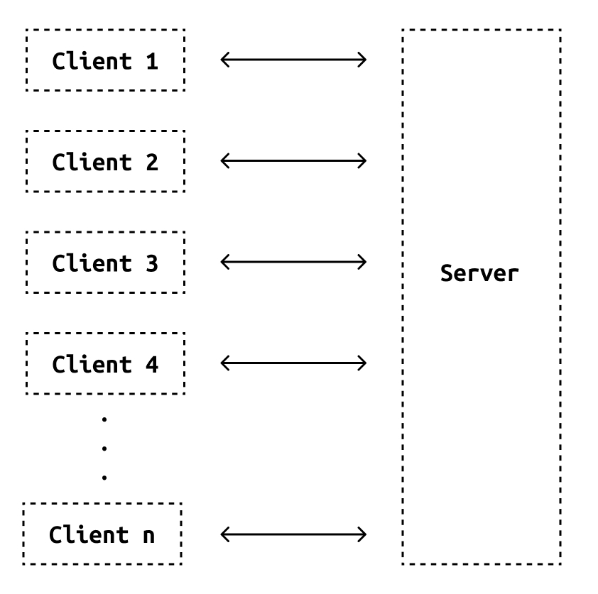
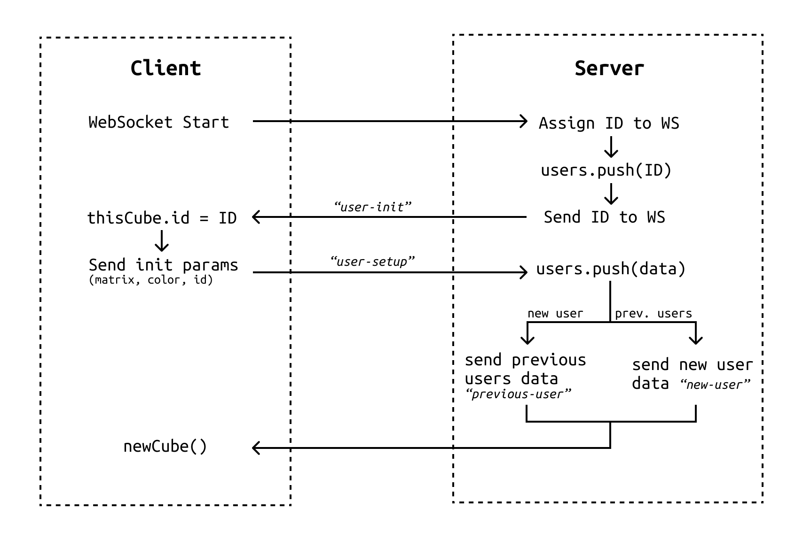
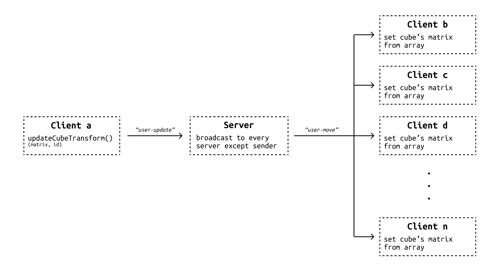

# 03 – Intro to Three.js – Multiplayer
*by Guillermo Montecions, March 2021*

This is the third of a series of [*intro to three.js tutorials*](https://github.com/guillemontecinos/intro-to-threejs). In this one we will convert the basic game developed in [02 – Intro to Three.js – Matrices and interaction](../02-matrices-and-interaction/02-matrices-and-interaction.md) into a multiplayer game, by learning how to write a [Node.js](https://nodejs.org/) server using [express](https://expressjs.com/) and implement [WebSockets](https://developer.mozilla.org/en-US/docs/Web/API/WebSockets_API) in three.js. The WebSockets implementation is based on Tome Igoe's [examples](https://tigoe.github.io/websocket-examples/).

## Writing a basic Node.js server
The architecture of the system we need to build consists of a server whith whom all the clients –users– stablish a WebSocket connection. Through this connection the clients send information to the server such as initial position and color, and position updates. This data is processed by the server and broadcasted over the network to all the clients. For this purpose we will write a Node.js (a JavaScript back-end environment) server that uses express to handle HTTP requests and responses.

<p align="center">
  
</p>

Before starting to write the server code, we need to create a new project with Node Package Manager ([npm](https://www.npmjs.com/)), a framework that will help us download and manage all libraries and dependencies of our project. To do that, go to the root folder of the project and type the following command in the console.

```bash
$ npm init
```

The system will ask you a couple of questions to customize the project, but for example we can just hit enter to all the questions. Then, let's create a script for that server under the name of `index.js`. Then, inside the server script let's start importing the packages we are going to use by calling the function `require(package)`. Let's start by importing `express` and `path` which we will use to set up the base server.

```js
const express = require('express')
const path = require('path')
```

After calling the packages from the server, we need to import them to the project modules' folder, by going to the main folder of the project and typing the following command in the terminal.

```bash
$ node install express
```

Similar thing hast to be done with `path`. Then, we can create the server by calling the function `express()` and assigning it to a variable, in this case called `app`. In order to serve more than one file (in this case the `index.html` file and the `multiplayer.js` script) we need to set an static folder that can be accessed by the client anytime, by telling the `app` to use a folder, which in this case is called `public`.

```js
// Instantiate express app
const app = express()

// Use the public folder to load html/js files
app.use(express.static('public'))
```

Then, in order to listen and respond to the HTTP requests (GET or/and POST) we need to set an event listener that catches each request. In this case we need to listen to the `GET` requests from the browser, which correspond to the action of typing a url in the browsing bar and hitting enter. We do that by calling the function `app.get()` that takes `'/'` as an argument, which means *any request to the server's root url*. As a response to that request we send the `index.html` file back to the browser. 

The final step to setup the server consists on choosing what port the server will be listening at, in this case `process.env.PORT || 3000` (which takes 3000 or a previously assigned port for a deployed server), and starting the server by calling the function `app.listen()` that takes the `port` as an argument and a callback that can be used to debug if the server is working properly.

```js
// on get '/' send page to the user
app.get('/', function (req, res){
    res.sendFile(path.join(__dirname, '/public/index.html'))
})

// Server init
const port = process.env.PORT || 3000
app.listen(port, function(){
    console.log('Server listening on port ' + port)
})
```

### Setting up WebSockets in the express server
WebSockets (WS) is a web communication protocol that is natively supported by most web browsers, but not in all back-end environments. Hence, we need to import a WS implementation for express that instantiates a connection and helps express handle incoming and outgoing messages. Let's use the module `express-ws` which instantiates a WS server by taking the server `app` as an argument.

```js
// Import and intialize ws server instance on express
const wsServer = require('express-ws')(app)
```

The WS server get's started by calling the express function `ws` that takes a url and a callback meant to handle events such as sockets connections, disconnections and received messages.

```js
// Callback function that get's executed when a new socket is intialized/connects
function handleWs(ws){}

// Sockets init
app.ws('/', handleWs)
```

## Setting up the client to stablish a WebSockets connection
As we said in the introduction, in this project we will use the script developed in the tutorial [02 – Intro to Three.js – Matrices and interaction](./02-matrices-and-interaction/02-matrices-and-interaction.md) to build a multiplayer game. Starting from that code, let's open an new WebSocket instantiated in the variable `const socket =  new WebSocket(url)`, that takes a server url starting with `ws://` insted `http://` or `https://`. Then, let's add a listener to the event `'message'` that will execute a the callback `readIncomingMessage` every time a new message is received. Let's also declare an empty array called `users` to keep track of all the users in the network (we'll get back to that later).

```js
// Web socket setup (https://developer.mozilla.org/en-US/docs/Web/API/WebSockets_API)
// Retrieve host's address
const url = 'ws://' + location.host
console.log(url)
// Open a new ws connection with the server
const socket = new WebSocket(url);
// Attach listeners to the socket
socket.addEventListener('message', readIncomingMessage)
// Use an array to keep track of users status
let users = new Array()
```

### Wrapping the cube mesh intialization on a function
```js
// Cube setup
// Two kind of cubes can be created: this cube, in which the user sets all their params, and the instances of other users cubes, which are intialized with the params provided by the server.
function newCube(isThis, color, initMatrix){
    // Cube
    const cubeGeometry = new THREE.BoxGeometry(1, 1, 1)
    // const cubeMaterial =  new THREE.MeshPhongMaterial({color: 0x873e2d})
    const cubeMaterial =  new THREE.MeshPhongMaterial({color: color})
    const cubeMesh = new THREE.Mesh(cubeGeometry, cubeMaterial)
    const cubeLookAt = new THREE.Vector3(0, 1, 0)
    cubeMesh.position.set(0, 0, 0)
    cubeMesh.matrixAutoUpdate = false
    cubeMesh.updateMatrix()
    if(isThis) {
        // Cube Camera
        const fov = 70
        const aspect = 2
        const near = 0.01
        const far = 20
        const camera = new THREE.PerspectiveCamera(fov, aspect, near, far)
        cubeMesh.add(camera)
        camera.position.set(0, -1.1, 1)
        camera.lookAt(0, 1, .5)
        
        cubeMesh.matrix.multiply(initMatrix)
        return {mesh: cubeMesh, lookAt: cubeLookAt}
    }
    else {
        cubeMesh.matrix.multiply(initMatrix)
        return cubeMesh
    }
}
// Intialize by default this cube
const posX = THREE.MathUtils.mapLinear(Math.random(), 0, 1, planeGuard.min.x, planeGuard.max.x)
const posY = THREE.MathUtils.mapLinear(Math.random(), 0, 1, planeGuard.min.y, planeGuard.max.y)
const translateMt = new THREE.Matrix4().makeTranslation(posX, posY, .5)
const thisCube = newCube(true, new THREE.Color().setHSL(Math.random(), .67, .4), translateMt)
scene.add(thisCube.mesh)
```

## Designing the interaction between client and server

<p align="center">
  
</p>

<p align="center">
  
</p>

## Code
```js
function updateCubeTransform() {
    
    // For efficiency purposes let's make all calculations and matrix update only when an interaction is detected
    if(moveFront || moveBack || boxZRotSpeed != 0) {
        .
        .
        .

        // Anytime the local cube's transform matrix is updated it has to be notified to the server and updated all over the network
        sendMessage(JSON.stringify({type: 'user-update', matrix: thisCube.mesh.matrix.elements, id: thisCube.id}))
    }
}


// Web socket incoming messages handler callback
function readIncomingMessage(e){ 
    // Parse the indoming data into a json object
    const data = JSON.parse(e.data) 
    // User init means the server has responded to the connection with the id it assigned to the user
    if(data.type === 'user-init') {
        thisCube.id = data.id
        console.log(thisCube)
        // Send to the server the initial attributes of the local cube
        sendMessage(JSON.stringify({type: 'user-setup', matrix: thisCube.mesh.matrix.elements, color: thisCube.mesh.material.color.getHex(), id: thisCube.id}))
    }
    // New user or previous user means a user has connected or there were users in the scene before the client connected.
    else if(data.type === 'new-user' || data.type === 'previous-user') {
        console.log(data.type)
        // Instantiate the cube and store it in the users array
        users.push({mesh: newCube(false, new THREE.Color().setHex(data.color), new THREE.Matrix4().fromArray(data.matrix)), id: data.id})
        // Add the cube to the scene so it can be rendered
        scene.add(users[users.length - 1].mesh)
        console.log(users[users.length - 1].mesh)
    }
    // User move indicates a user in the network has updated their transformation matrix
    else if(data.type == 'user-move') {
        // Find the user that moved in the users array
        const index = users.findIndex(user => user.id == data.id)
        console.log('user ' + users[index].id + ' moved.')
        // Update the cube's matrix with the data received from the server. Note the data was sent as an array.
        users[index].mesh.matrix.fromArray(data.matrix)
    }
    // Delete the user that disconnected from the users array
    else if(data.type == 'user-disconnect') {
        const index = users.findIndex(user => user.id == data.id)
        console.log('user ' + users[index].id + ' disconnected')
        // Remove the cube from the scene
        scene.remove(users[index].mesh)
        // Remove the user form users
        users.splice(index, 1)
    }
}

function sendMessage(data){
    if(socket.readyState === WebSocket.OPEN){
        socket.send(data)
    }
}
```

```js
// Callback function that get's executed when a new socket is intialized/connects
function handleWs(ws){
    console.log('New user connected: ' + ws)
    // As soon as a new client connects, assign them an id, store it in the users array and send it back to the client
    ws.send(JSON.stringify({type: 'user-init', id: users.length}))
    users.push({socket: ws, id: users.length})

    // When a user disconnects, remove it from the users array and inform all the clients in the network
    function endUser() {
        const index = users.findIndex(user => user.socket == ws)
        users.forEach((user) => {
            if(user.socket != ws) {
                // Let know all users that aren't the one disconnecting from the disconnection
                user.socket.send(JSON.stringify({type: 'user-disconnect', id: users[index].id}))
            }
        })
        console.log('user id: ' + users[index].id + ' disconnected')
        users.splice(index, 1)
    }
    // This callback is triggered everytime a new message is received
    function messageReceived(m){ 
        // Parse de data to json
        const data = JSON.parse(m)
        // Data setup means a new user received their id and sends back all the initialization parameters
        if(data.type == 'user-setup') {
            // Broadcast user setup message called new-user to setup new user in all users except from the originary
            users.forEach((user) => {
                // If the user correpsonds to the one on setup, store its initialization data
                if(user.socket == ws) {
                    user.color = data.color
                    user.matrix = data.matrix
                }
                // If there are users different to the one setting up, it means there were users previously connected. Hence, we have to let the new user know of their existance.
                else {
                    // Send to the new user the previous users data
                    ws.send(JSON.stringify({type: 'previous-user', id: user.id, color: user.color, matrix: user.matrix}))
                    // Send to other users the new user setup
                    data.type = 'new-user'
                    user.socket.send(JSON.stringify(data))
                }
            })
        }
        else if(data.type == 'user-update') {
            // When a user udpates its position, let all other users about it.
            users.forEach((user) => {
                if(user.socket != ws) {
                    user.socket.send(JSON.stringify({type: 'user-move', matrix: data.matrix, id: data.id}))
                }
            })
        }
    }
    // Attach callbacks to the socket as soon it gets connected
    ws.on('message', messageReceived)
    ws.on('close', endUser)
}

// Sockets init
app.ws('/', handleWs)
```